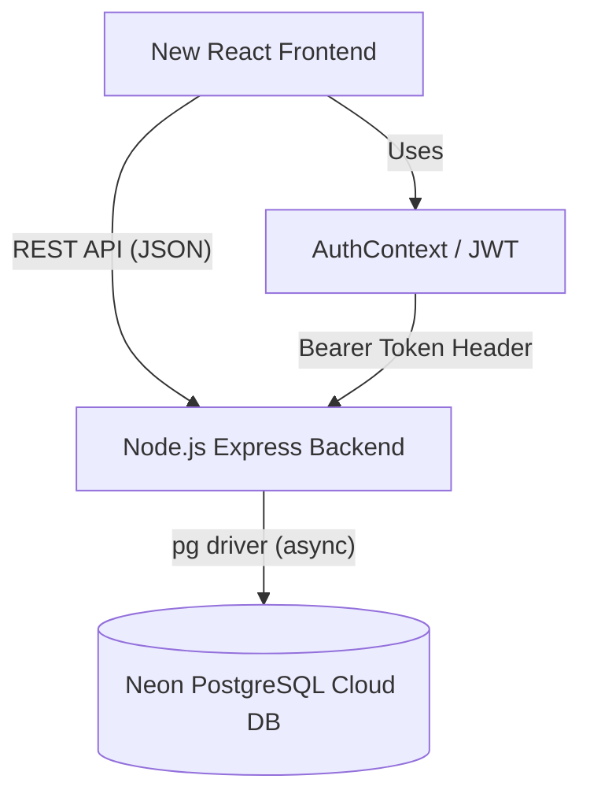
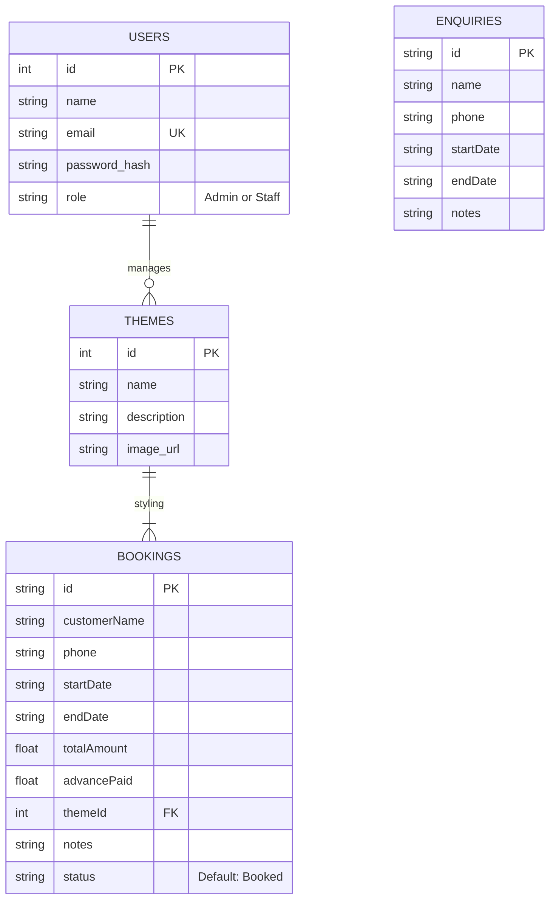

# Classic Function Hall - Frontend Rebuild Architecture 

This document outlines the **System Architecture**, **Database Schema**, and **API Contracts** for the Classic Function Hall Management system. 

You can feed this entire document into your chosen AI code generator (like v0, Lovable, or Claude) to act as the "source of truth". The AI will know exactly what the backend expects and what endpoints to call to build a completely new React frontend.

## 1. System Architecture

We have already built a robust, cloud-ready backend. The new frontend only needs to consume these existing RESTful APIs.

*   **Backend Base URL:** `http://localhost:5001/api`
*   **Authentication:** JWT (JSON Web Tokens). Most API routes require the header `Authorization: Bearer <token>`.
*   **Dates:** All dates (`startDate`, `endDate`) are stored and transmitted as ISO 8601 strings (e.g., `2024-03-15T00:00:00.000Z`).

---

## 2. Core Flows & Requirements for the New Frontend

The new frontend should have these core screens/flows:

1.  **Authentication Flow (`/login`)**
    *   Form taking `email` and `password`. On success, it receives a JWT which should be stored in `localStorage` or memory, and sent in subsequent API requests.
2.  **Interactive Calendar Dashboard (`/home`)**
    *   A grid month-view calendar showing all bookings and enquiries.
    *   Must plot "multi-day" events by checking if a date falls between an event's `startDate` and `endDate`.
    *   Bookings should be visually distinguished from Enquiries (e.g., Booked = Red, Enquiry = Yellow, Available = Green).
    *   Clicking a date should open a Modal showing the events for that day, or allow creating a new booking.
3.  **Booking Validation & Form (`/booking/create`)**
    *   Must collect: `customerName`, `phone`, `startDate`, `endDate`, `totalAmount`, `advancePaid`, `themeId`, `notes`.
    *   Display a dropdown of themes fetched from the `/themes` API.
    *   Auto-calculate the "Balance Left" (`totalAmount` - `advancePaid`).
4.  **Themes Gallery (`/themes`)**
    *   Grid view displaying available decoration themes.
    *   (Optional but good): allow admins to add new themes by sending name/desc/imageUrl to the `POST /themes` endpoint.

---

## 3. Database Schema Reference

The PostgreSQL database relies on these primary tables. (The frontend does not query the DB directly, but understanding the shape of the data is crucial).

---

## 4. REST API Contracts

Here are the precise endpoints the new frontend must call to interact with the backend.

### A. Authentication
*   **POST** `/auth/login`
    *   **Body:** `{ "email": "admin@classichall.com", "password": "password123" }`
    *   **Response:** `{ "token": "jwt_string", "user": { "id": 1, "name": "...", "email": "...", "role": "Admin" } }`
*   **GET** `/auth/me`
    *   **Headers:** `Authorization: Bearer <token>`
    *   **Response:** `{ "user": { ... } }`

### B. Themes
*   **GET** `/themes`
    *   **Response:** `[ { "id": 1, "name": "Royal", "description": "...", "image_url": "..." } ]`
*   **POST** `/themes` *(Requires Admin Role)*
    *   **Headers:** `Authorization: Bearer <token>`
    *   **Body:** `{ "name": "...", "description": "...", "image_url": "..." }`
    *   **Response:** `{ "id": 2, "name": "..." }`

### C. Bookings
*   **GET** `/bookings`
    *   **Headers:** `Authorization: Bearer <token>`
    *   **Response:** `[ { "id": "123", "customerName": "John", "startDate": "...", "endDate": "...", "themeName": "Royal", "themeImage": "..." } ]`
*   **POST** `/bookings`
    *   **Headers:** `Authorization: Bearer <token>`
    *   **Body:** `{ "customerName": "...", "phone": "...", "startDate": "ISO string", "endDate": "ISO string", "totalAmount": 50000, "advancePaid": 10000, "themeId": 1, "notes": "..." }`
    *   **Response:** `{ "id": "timestamp_id", "message": "Success" }`

### D. Enquiries
*   **GET** `/enquiries`
    *   **Headers:** `Authorization: Bearer <token>`
    *   **Response:** `[ { "id": "123", "name": "Jane", "startDate": "...", "endDate": "..." } ]`
*   **POST** `/enquiries`
    *   **Headers:** `Authorization: Bearer <token>`
    *   **Body:** `{ "name": "...", "phone": "...", "startDate": "ISO string", "endDate": "ISO string", "notes": "..." }`
    *   **Response:** `{ "id": "timestamp_id", "message": "Success" }`

### E. Calendar
*   **GET** `/calendar`
    *   **Headers:** `Authorization: Bearer <token>`
    *   **Description:** A helper endpoint that merges Bookings and Enquiries into a single array for easy rendering on a calendar grid.
    *   **Response:** `[ { "id": "123", "title": "Customer Name", "startDate": "...", "endDate": "...", "type": "booked" | "enquiry" } ]`
